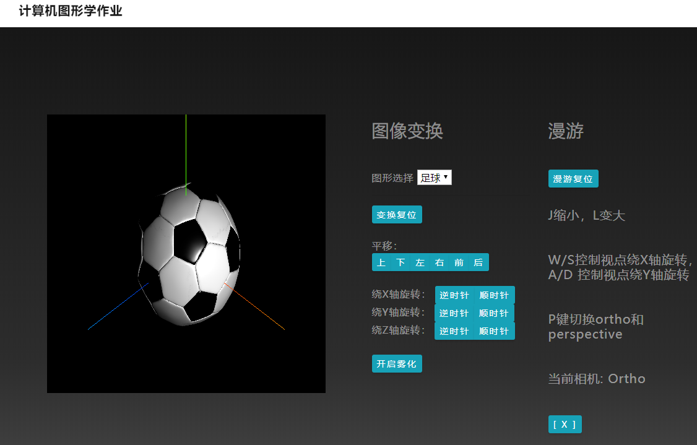

# Graphics-Webgl
It's my final graphics homework in SCU. 
## Overall Interaction

## How to use
There's must be a server to show the model. I used the extension called "**Live Server**" in VSCode when coding in the first place, and *nginx* when deploying. 
## Basic info
- The model is from [Clara.io](https://clara.io/scenes)
- The program used the 3D Lib "**Three.js**"
- The framework of font-end using bootstrap.
### Functions
- The presentation of three different models
- Light and fixture
- Move in 6 directions
- Rotate in 6 directions
- The feature of fog
- Scale the model
- Move the view point in 4 directions
- Two kinds of camera
